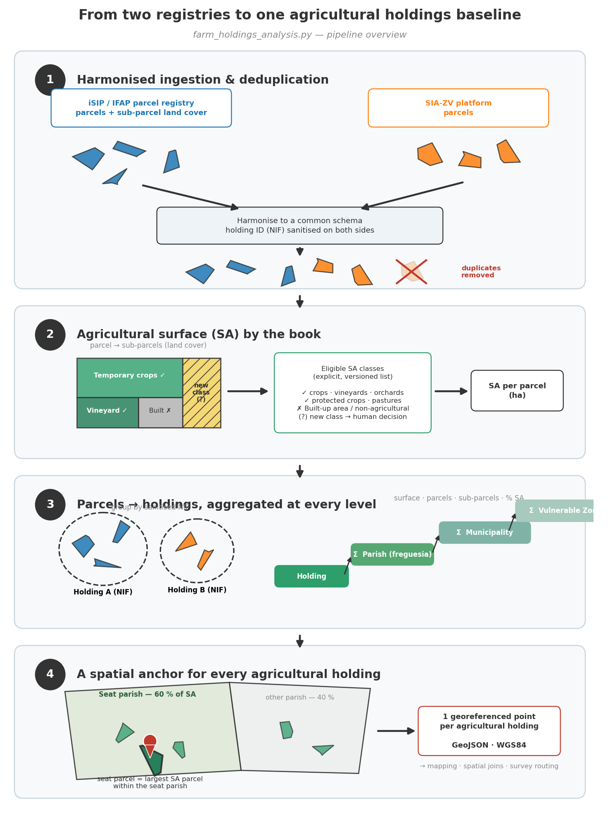
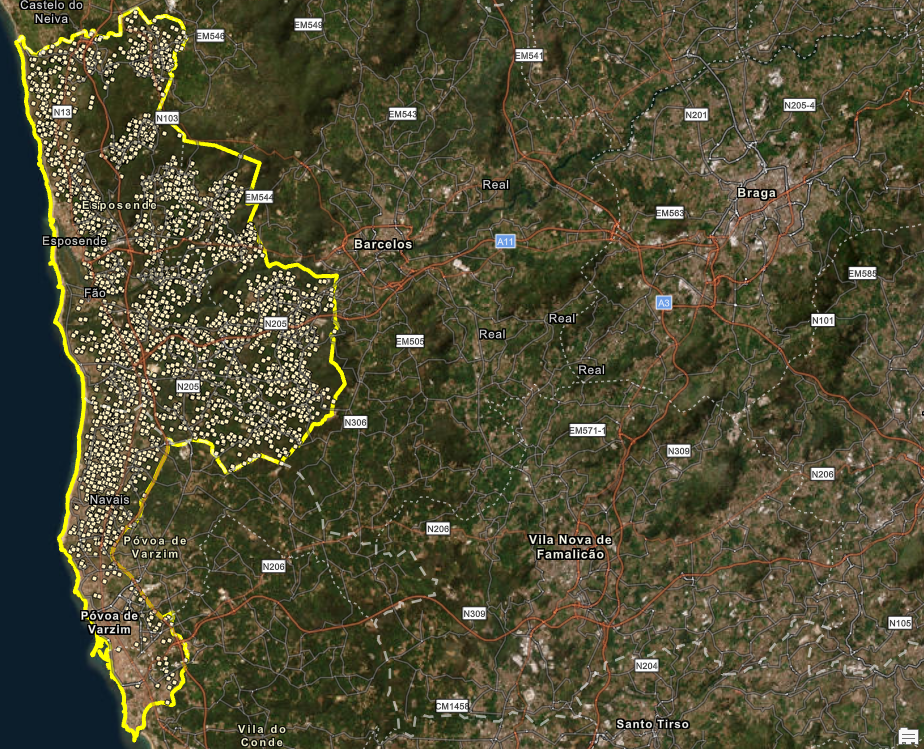
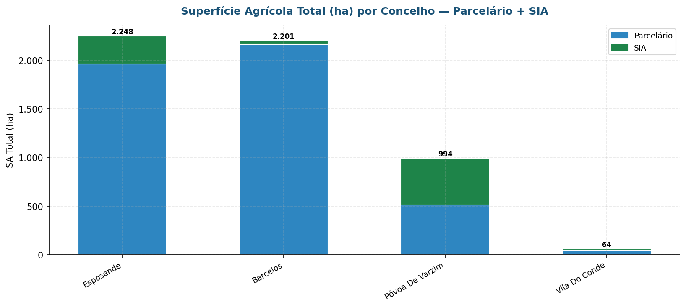
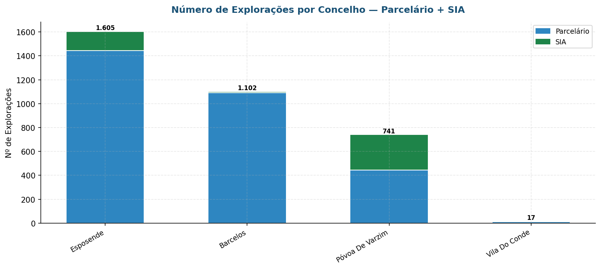

# Building the agricultural holdings baseline of a Nitrates Vulnerable Zone
### Multi-source integration of agricultural registries · Esposende – Vila do Conde Vulnerable Zone, Portugal

> Integrating the national land-parcel registry (iSIP/IFAP) with the
> zone's own monitoring platform (SIA-ZV) into a single, deduplicated
> universe of agricultural holdings — the statistical and spatial baseline on which
> nitrate monitoring, pressure analysis and survey sampling all depend.

---

*From two overlapping registries to one deduplicated, spatially anchored agricultural holdings baseline — the four stages of the pipeline.*

*Density of agricultural holding seat locations across the Vulnerable Zone — each agricultural holding anchored to its dominant-parish largest parcel.*

*Utilised agricultural area (ha) by municipality and source — 835 ha recovered from the SIA platform alone.*

*Agricultural holdings by municipality, stacked by source — the SIA layer (top) adds holdings invisible to the national parcel registry, concentrated in Póvoa de Varzim and Esposende.*

## Why a agricultural holdings baseline matters

Monitoring a Nitrates Vulnerable Zone means, before anything else,
*knowing* it: the agricultural area, the number of agricultural holdings, the
livestock numbers — and, for each of these variables, their spatial
distribution. Contamination data only becomes interpretable when read
against these pressure indicators: comparing the evolution of nitrate
concentrations with the evolution of agricultural area, agricultural holdings and
livestock is what turns monitoring into diagnosis. That comparison requires
a **stabilised, repeatable methodology** — if the way agricultural holdings are counted
changes from year to year, the time series is meaningless.

The baseline also has a direct operational use: the universe of agricultural holdings
identified here is the **sampling frame for the annual farmer survey**
(farming practices and nitrate levels in private wells and boreholes).
An incomplete universe biases the sample; a duplicated one wastes field
effort.

## The problem

No single source describes the zone's farms completely:

- The **national land-parcel registry** (iSIP, managed by IFAP) covers
  agricultural holdings that apply for support schemes — but many small horticultural
  agricultural holdings never register;
- The **SIA-ZV platform**, used since 2013 for Vulnerable Zone monitoring,
  captured agricultural holdings through field contact — but the
  platform is currently unavailable, freezing its data in time;
- The two sources overlap, use different identifiers and structures, and
  each contains records the other lacks.

Using either source alone undercounts the zone; using both naively
double-counts it. And beyond counting, each agricultural holding needs a **spatial
anchor** — a place on the map — for cartography, spatial analysis and
survey logistics, which no registry provides directly.

## The solution

A reproducible pipeline (`farm_holdings_analysis.py`) that reads,
harmonises and integrates the two sources, and derives the indicators and
spatial anchors the monitoring programme needs:

**1. Harmonised ingestion** — parcels (geometry, agricultural holding identifier,
administrative units) and sub-parcels (land-cover classification) are read
from the registry geodatabase and joined on a text key sanitised on both
sides; records from the SIA source are brought to the same schema.

**2. Agricultural surface by the book** — utilised agricultural area (SA)
is computed from sub-parcel land-cover classes against an explicit,
auditable list of eligible classes (temporary and permanent crops,
protected crops, vineyards, orchards, pastures…). New classes appearing in
the registry are flagged for human decision rather than silently included
— the list *is* the methodology, versioned with the code.

**3. Aggregation at every level that matters** — surface, parcel and
sub-parcel counts per holding, per parish (*freguesia*), per municipality
and for the whole zone; share of SA per
holding.

**4. A spatial anchor for every agricultural holding** — each agricultural holding is assigned its
**seat parish** (the parish concentrating most of its SA) and, within it,
its **seat parcel** (the largest SA parcel). The result is one
georeferenced point per agricultural holding (exported as GeoJSON, WGS84) — the anchor
used for mapping, spatial joins and survey routing.

**5. Territorial fragmentation** — for each agricultural holding, the number of
parishes across which its parcels spread: a direct measure of how
scattered farm operations are, with consequences for both nutrient
management and inspection logistics.

**6. Automated reporting** — tables, charts and a formatted Word report
generated end-to-end, so the analysis can be re-run on every registry
update with zero manual assembly.

## Results (2026 edition)

| Indicator | Value |
|---|---|
| Agricultural holdings identified | **3,465** (86.3 % parcel registry · 13.7 % SIA-only) |
| Utilised agricultural area | **5,509 ha** (84.8 % / 15.2 % by source) |
| Parcels / sub-parcels | 16,141 / 25,064 |
| Municipalities covered | 4 |
| Mean parishes per agricultural holding | 1.41 (max: 7) |
| Single-parish agricultural holdings | 68.7 % |

The SIA integration alone added **475 agricultural holdings and 835 ha** invisible to
the national registry — a substantial share of precisely the small,
intensive horticulture that matters most for nitrate pressure. This
integration is part of a broader multi-source effort (including livestock
and survey data) that has nearly doubled the universe of known agricultural holdings in
the zone.

## Why it matters

- **A stable denominator** — pressure indicators (agricultural holdings, SA) can now be
  tracked over time with a fixed, documented method, and read against the
  nitrate series;
- **An unbiased sampling frame** — the annual farmer survey draws from the
  full, deduplicated universe rather than from whichever registry happened
  to be at hand;
- **Every agricultural holding on the map** — the seat-parcel anchor turns an
  administrative list into a spatial layer, enabling the crossing with
  wells, greenhouses and monitoring results;
- **Resilience to source failure** — with SIA-ZV currently unavailable,
  its information survives inside the integrated baseline instead of being
  lost with the platform.

## Repository contents

| File | Purpose |
|---|---|
| `farm_holdings_analysis.py` | Full pipeline: ingestion, SA computation, aggregation, seat-parish/parcel assignment, fragmentation analysis, GeoJSON and report outputs |
| `requirements.txt` | Python dependencies |

Paths and layer names in the script are placeholders — point them at your
own registry geodatabase.

## Stack

Python · pandas · GeoPandas · Fiona · matplotlib · python-docx ·
Esri FileGDB (read) · GeoJSON (output)

## About the data

The land-parcel registry (iSIP/IFAP), the SIA-ZV records and all derived
agricultural holding-level results are institutional data and are not published here.
Figures above are aggregate statistics from the 2026 analysis. The code is
shared as a working reference implementation.

---

**Luís Filipe Pacheco** — Senior Engineer & Data Scientist,
CCDR-Norte, I.P. · [GitHub profile](https://github.com/LFilipePacheco) ·
[LinkedIn](https://www.linkedin.com/in/lu%C3%ADs-filipe-pacheco-471495b/) ·
[ORCID](https://orcid.org/0009-0001-7676-6542)
